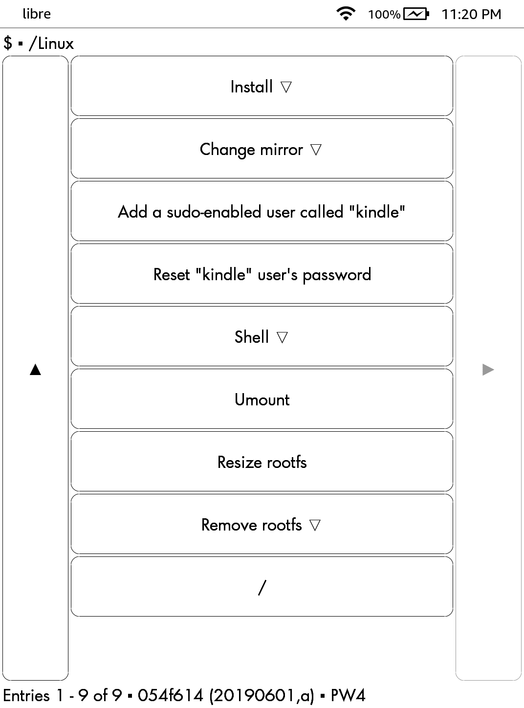

# Install

* [jailbreak](https://www.mobileread.com/forums/forumdisplay.php?f=150) and install [KUAL](https://www.mobileread.com/forums/showthread.php?t=203326)
* install [kterm](https://github.com/bfabiszewski/kterm/releases)
* copy `extensions` to Kindle.

# Build

## Requirements

`nodejs` `p7zip` `docker` and normal GNU/Linux

[you need to `sudo usermod -aG docker $(whoami)`](https://stackoverflow.com/questions/21871479/docker-cant-connect-to-docker-daemon)

[Once you need to configure binfmt-support on your Docker host. This works locally or remotely (i.e using boot2docker or swarm).](https://github.com/multiarch/alpine)

```bash
# configure binfmt-support on the Docker host (works locally or remotely, i.e: using boot2docker)
$ docker run --rm --privileged multiarch/qemu-user-static:register --reset
```

## Build ZIP

```bash
$ make
```

# Screenshot


