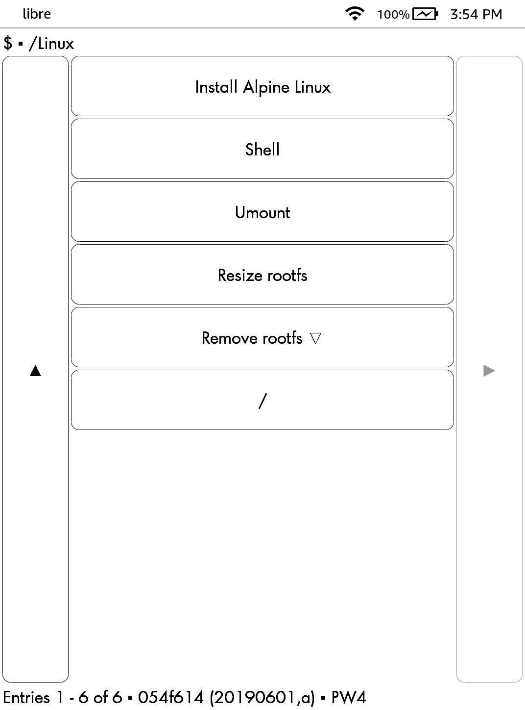

# Build

## Requirements

`nodejs` `p7zip` `docker` and normal GNU/Linux

## Build ZIP

```
$ make
```

# Install

* [jailbreak](https://www.mobileread.com/forums/forumdisplay.php?f=150) and install [KUAL](https://www.mobileread.com/forums/showthread.php?t=203326)
* install [kterm](https://github.com/bfabiszewski/kterm/releases)
* copy `extensions` to Kindle.

# Screenshot


